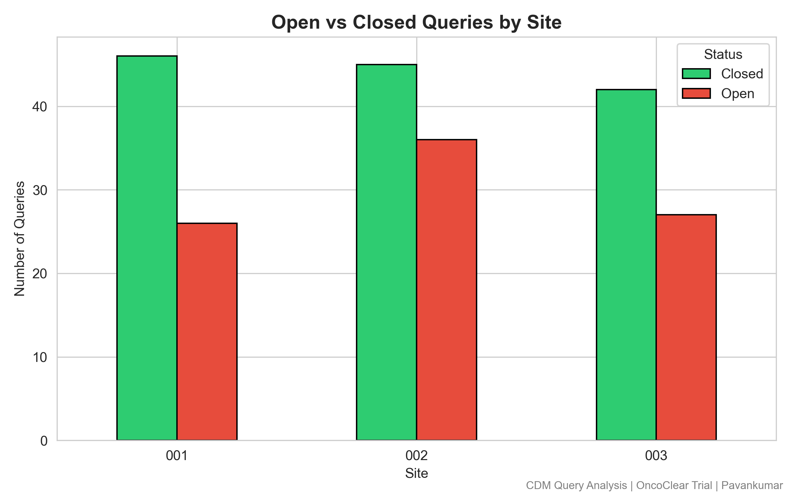
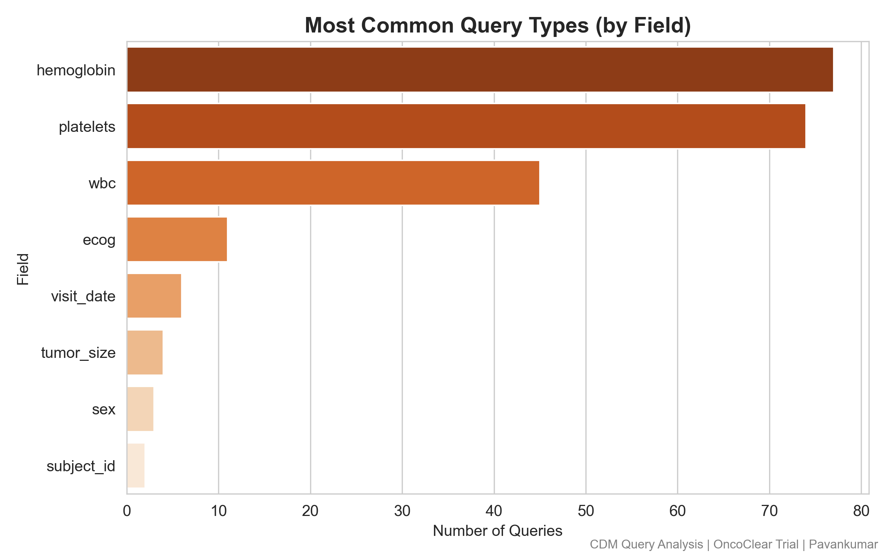
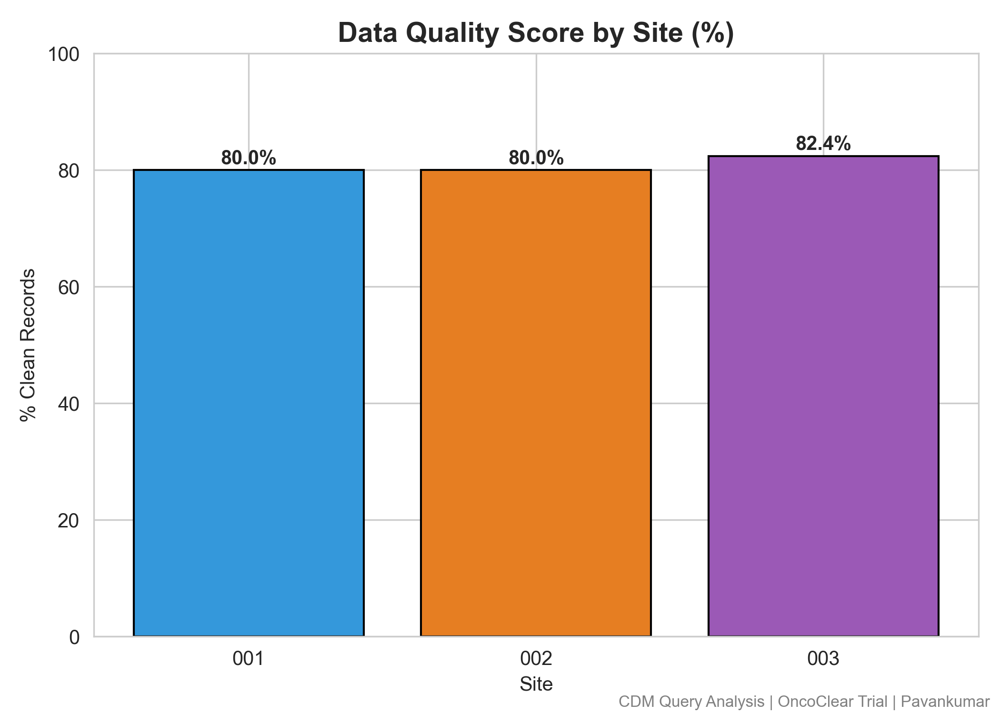
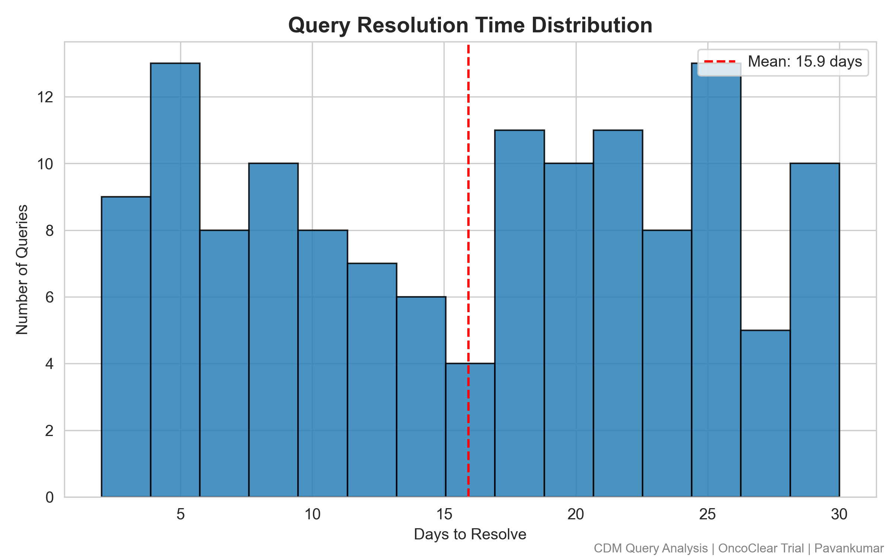

# OncoClear CDM Query Detection Pipeline

## 📋 Objective
This project simulates a Clinical Data Management (CDM) workflow for a fictional Phase II 
oncology trial (OncoClear) — mimicking the edit check and query management process 
used in real EDC systems like Medidata Rave.

## 🔬 Trial Context
- **Drug:** OncoClear (fictional) for Non-Small Cell Lung Cancer (NSCLC)
- **Design:** Phase II, 3 sites, 50 subjects, 5 visits
- **Key assessments:** CBC (WBC, Hemoglobin, Platelets), Tumor size, 
ECOG Performance Status, Adverse Events (CTCAE grading)

## 🔍 What This Project Does

### Step 1: Synthetic CRF Data Generation
Generated a realistic clinical trial dataset (250 records) with 
demographics, CBC values, tumor assessments, ECOG scores, and AE data 
across 3 investigator sites and 5 visit timepoints.

### Step 2: Error Injection
Deliberately introduced 10 types of realistic data errors:
- Missing critical values (WBC, Hemoglobin, Platelets, ECOG, Tumor size)
- Out-of-range CBC values (high WBC, critically low Hemoglobin/Platelets)
- Visit dates before enrollment date
- Future visit dates
- Invalid ECOG scores (outside 0–4 range)
- Duplicate subject IDs
- Inconsistent sex coding
- Biologically implausible tumor size (0mm)

### Step 3: Automated Edit Check Engine
Built a Python-based edit check script that detects all injected errors 
and auto-generates a structured query report — mimicking what Medidata 
Rave does through configured edit checks.

**Total queries generated: 222 across 3 sites**

### Step 4: Query Resolution Simulation
Simulated query lifecycle — 60% of queries resolved with realistic 
resolution times (2–30 days), average resolution time: 15.9 days.

## 📊 Dashboard Visuals

### Open vs Closed Queries by Site

### Most Common Query Types

### Data Quality Score by Site

### Query Resolution Time Distribution

## 🏥 CDM Concepts Demonstrated
- **Edit checks** — automated validation rules detecting data anomalies
- **Query management** — structured query raising, tracking, and resolution
- **Data quality metrics** — site-level quality scoring and benchmarking
- **Query aging** — tracking how long queries remain open (key KPI in real trials)
- **SDV readiness** — clean vs flagged records per site

## ⚠️ Note on Scope
This project uses synthetic data to simulate CDM workflows. 
In a real trial, edit checks would be configured directly in the EDC system 
(e.g., Medidata Rave), and queries would be raised/resolved by site staff 
through the EDC interface. This project demonstrates the underlying logic 
and data management principles.

## 🛠️ Tools Used
Python (pandas, numpy, matplotlib, seaborn) | Simulated EDC workflow | 
CTCAE grading | ECOG scale | CBC normal ranges

## 📁 Repository Contents
- `oncoclear_cdm_pipeline.ipynb` — full notebook with all steps
- `oncoclear_clean_data.csv` — original synthetic CRF dataset (250 records)
- `oncoclear_messy_data.csv` — dataset with injected errors (260 records)
- `oncoclear_query_report.csv` — auto-generated query report (222 queries)
- `queries_by_site.png` — open vs closed queries per site
- `query_types.png` — most common error/query types
- `data_quality_score.png` — site-level data quality scores
- `resolution_time.png` — query resolution time distribution

## 👤 Author
Pavankumar — Healthcare professional transitioning into Clinical Data Science 
| PGD Clinical Research & Bioinformatics | 
[LinkedIn](https://www.linkedin.com/in/pavankumarofficial369)
